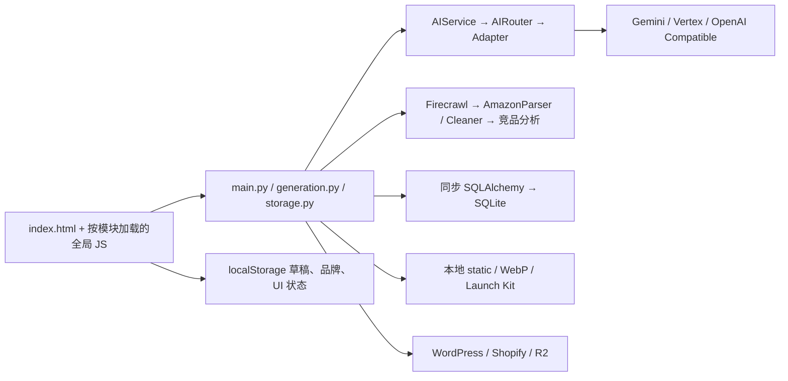
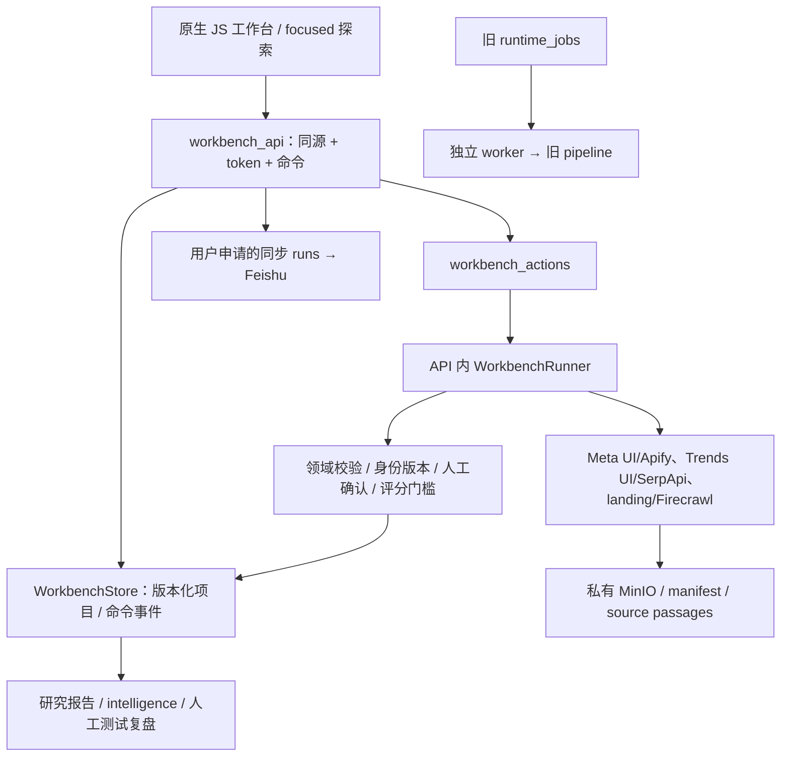

# 01 项目现状分析

评估日期：2026-10-08（Asia/Shanghai）。状态：源码评估完成，融合实施未获授权。阅读顺序：01 → 02 → 03 → 04 → 05。

## 1. 范围与证据约定

- **M** = 本机 `/Users/xiachengpeng/code/AI E-commerce Tools/`。
- **R** = `xcp@192.168.31.112:/Users/xcp/rabbit-hole/`。R 路径均为远端路径，不能在本机直接打开。
- 下文 `M:backend/db.py:10` 表示主项目目录下该文件第 10 行；`R:src/rabbit_hole/workbench_api.py:103` 表示远端文件位置。位置以本次工作树为准。
- **事实**：源码、配置、依赖元数据或实际只读请求支持；**推断**：基于事实的架构判断；**待验证**：未执行的行为或未检查的运行数据。存在代码不等于外部服务已正常连通。
- 主项目 HEAD：`64092ee9bf6a4163b7128fde1a9ee08dfb7e3894`；存在大量已修改及未跟踪业务、测试、文档文件。本报告针对当前工作树，不仅针对 HEAD。
- SOP HEAD：`6e1ae6cd110fd93a92d47e790bed064974ff0a39`；读取时 `git status --short` 无输出。
- 用户澄清 SOP 位于上述远端。本机 `/Users/xiachengpeng/code/jeffrey` 的旧候选不是本报告待融合对象，不能据其旧版本实施迁移。
- 未读取密钥值，未查询业务数据内容，未导入应用模块、启动服务、运行测试套件、安装依赖或执行迁移。本次唯一持久交付是本目录五份 Markdown。

## 2. 主项目技术架构

### 2.1 目录与入口

```text
AI E-commerce Tools/
├── run.py                       # 两个本机服务的进程管理
├── backend/
│   ├── main.py                  # 路由、初始化、历史、配置、竞品、导出等
│   ├── config.py                # 环境默认值
│   ├── db.py                    # SQLAlchemy ORM + SQLite + 内置升级逻辑
│   ├── models/{request,settings,storage}.py
│   ├── routes/{generation,storage}.py
│   ├── services/                # AI、采集、物料、存储与重试
│   ├── tests/
│   ├── history.db               # 私有运行数据，本次不打开
│   └── static/                  # 生成文件，非 Git 业务源码
├── frontend/
│   ├── index.html               # 页面壳及各业务面板
│   ├── js/                     # 按业务划分、全局函数协作
│   ├── css/                    # Tailwind 输入与业务样式
│   ├── tests/                  # node:test
│   ├── package.json
│   └── package-lock.json
└── docs/
```

事实：`M:run.py:21,31,54,63` 启动 Uvicorn 后端 127.0.0.1:9503 与 Python 静态服务器 127.0.0.1:9502。缺少 CSS 产物时会调用 npm 构建（38 行）；因此本次未运行此入口。前端没有 React/Vue/Next 构建，npm 脚本只编译 Tailwind CSS（`M:frontend/package.json`）。

### 2.2 栈与实际版本

| 项目 | 声明/实际读取 | 含义 |
|---|---|---|
| Python | AGENTS 建议 3.10+；当前 .venv 3.12.14 | 可以与 SOP 的 3.12 运行要求取交集，但不代表依赖可随意合并 |
| FastAPI / Uvicorn | 当前 .venv 0.141.1 / 0.52.4 | 后端 ASGI |
| Pydantic / SQLAlchemy | 当前 .venv 2.13.5 / 2.0.52 | 请求模型/同步 ORM |
| httpx / google-genai | 当前 .venv 0.28.1 / 2.22.0 | 外部 HTTP/Google AI |
| Pillow / pytest | 当前 .venv 12.3.0 / 9.1.1 | 图像处理/测试 |
| Node | 本机 v26.8.1 | 语法检查工具，不是应用服务端 |
| Tailwind | package.json `^3.4.1`；有 package-lock.json | 保留现有 UI/CSS 构建 |

`M:backend/requirements.txt` 除 Pillow 下限外没有固定版本；上表是本机虚拟环境元数据，不是可复现的后端锁文件。不能用“声明一致”推出今后重新安装一定一致。

### 2.3 数据与配置

事实：

- `M:backend/db.py:10`：`SQLITE_DB_PATH` 可覆写数据库文件；默认 `backend/history.db`。
- 同步 Engine、SessionLocal（13、36 行），允许跨线程使用 SQLite；连接设置 foreign_keys、WAL、busy_timeout、synchronous（18 行起）。
- `init_db()` 调用 create_all 和内置升级（258 行）；存储升级中会 rename/复制/drop 旧表（292、306、317 行）。**导入 main 就可能改库**：`M:backend/main.py:226–228` 执行数据库、AI 默认配置和采集配置初始化。
- 生成文件清理在 lifespan 执行，阈值 86400 秒（`M:backend/main.py:231–238`）。研究证据不能混入这个有自动清理行为的资源目录。
- `M:backend/config.py:5` 加载 backend/.env，系统环境优先。AI 环境配置仅作首次导入默认值，后续数据库设置生效。
- 主项目品牌档案既使用 localStorage 又调用后端品牌 API；它不是统一、强类型的产品主数据模型（`M:frontend/js/brand_context.js:33,50,64,85`）。

| 数据模型 | 主要字段/用途 | 位置 |
|---|---|---|
| AnalysisHistory | URL、single/matrix、JSON 结果 | db.py:39 |
| ListingHistory / AdsHistory | 产品名、平台、营销内容 | db.py:47 / 73 |
| TranslationHistory / TextTranslationHistory | 图像/文本翻译历史 | db.py:55 / 64 |
| RenderHistory | 图像 base64、metadata_info；详情生成历史 | db.py:85 |
| SquareRedrawHistory / Batch / Item | 批次、状态、尺寸、输入输出路径及失败信息 | db.py:94 / 111 / 121 |
| WatermarkRemovalHistory | 文件名、JSON 结果 | db.py:103 |
| AppSetting | JSON 键值设置，含品牌档案用途 | db.py:138；main.py:2446 |
| AIProviderConfig / AICapabilityBinding | 提供商、模型、密钥、text/image 能力绑定 | db.py:146 / 199 |
| StorageConfig / FirecrawlConfig | 多目的存储账号和采集配置 | db.py:208 / 243 |

现有历史表不是电商订单、SKU 库存或通用 SOP 状态机。字段中的时间多为 naive datetime；新跨服务数据必须显式 UTC，显示时转 Asia/Shanghai。

### 2.4 依赖与数据流



事实：`M:backend/routes/generation.py:124–179` 支持 text/image 能力归一化路由；`M:backend/services/ai_router.py:9–20` 读取数据库快照并统一重试；`M:frontend/js/app.js:28–114` 从 /config 加载公开路由。前端业务调用后端，不应新增浏览器直连 AI 提供商。

注意：`generation.py:26–30` 的路由会反向延迟导入 main，存在耦合。新研究模块不能照抄这个耦合模式，也不应借融合全面拆分现有 main。

### 2.5 主项目主要功能清单

完成度统一按“真实入口 + 实现存在”判断；下表所有外部 AI、抓取、上传效果均待端到端验证。复用策略与详细分类见 02。

| 模块/业务问题 | 输入 → 输出与数据流 | 核心文件/技术/关系 | 当前完成度及复用判断 |
|---|---|---|---|
| 竞品 URL 分析与比较 | URL → Firecrawl markdown → 解析/AI → 分数/比较 → history、转营销档案 | main.py:527,556,664；services/firecrawl.py、amazon_parser.py、cleaner.py、ai_single.py、ai_compare.py、scoring.py:75；frontend/js/analysis.js | 实现存在；保留为商业分析，不能替代 SOP 证据门槛 |
| 详情图与 DTC PDP 工作台 | 产品图/确认事实/模块配置 → AI 规划、文案和图像 → 画廊/五样式 PDP、重试、历史 | frontend/js/details.js、config.js:6–23、app.js；AI route、render history；Canvas/html2canvas | 实现存在且前端体量大；主项目核心，不迁出 |
| 详情交付与 Launch Kit | PDP、sections、SEO → HTML/JSON-LD/manifest/ZIP | main.py:2414,2431；services/launch_kit_service.py；details.js；tests/test_launch_kit_api.py | 导出实现存在；“生成部署包”不等于自动部署完整商店 |
| Listing | 名称/卖点/图 → 视觉提取、生成、合规提示、分段重生成 | routes/generation.py:54,67,78,89；listing_service.py:418,576,593,660；listing.js | 实现存在；接收经过确认的研究摘要有价值；合规提示不能视为认证 |
| 广告营销文案 | 产品事实、平台、地区、语言/图片 → 多平台文案/创意 brief → AdsHistory | routes/generation.py:101；ads_service.py:222,411；ads.js | 实现存在；与 SOP 原广告原文管理业务不同 |
| 图片翻译与本地化 | 图/语言 → 文字识别、清理/重绘、渲染 → 图像/历史 | frontend/js/translate.js；AI text/image route；TranslationHistory | 实现存在；不支持把竞品广告翻译结果当原文证据 |
| 批量文本翻译 | 文本 + 多目标语言 → 单次 batch 请求 → translations/cards/history | generation.py:33；text_translate.js；AIService；TextTranslationHistory | 实现存在；保留营销本地化语义 |
| 尺寸重绘 | 上传队列/比例 → Batch/Item → 逐项处理/重试 → 预览、ZIP、历史 | main.py:2348–2399；square_redraw_service.py；square_redraw.js | 持久批次实现；不等同通用长任务队列 |
| 水印/物体消除 | 图 + 掩膜/选区 → AI 编辑 → 结果/局部历史 | generation.py:113；watermark_removal_service.py；watermark_removal_core.js、watermark_removal.js | 实现存在；不能自动处理 SOP 证据原件 |
| 图像压缩与万能上传 | 图队列 → Pillow WebP、SEO 命名/AI 标签 → 目的地公共图片 URL | generation.py:204；image_compression_service.py；universal_uploader.js；storage_service.py | 实现存在；适合营销资产，不适合私有研究原件 |
| WordPress/Shopify/R2 多目标托管 | 保存配置/选站 → 后端上传 → 地址替换/回退 | routes/storage.py:26–96；storage_service.py；models/storage.py；details.js | 实现存在；保留目的地隔离和模糊结果停止重试规则 |
| 品牌营销画像与跨模块交接 | 人工/竞品摘要 → 品牌档案 → Listing/Ads/Details | brand_context.js:33–99；main.py:2446,2454；analysis.js；AppSetting/localStorage | 有真实持久化；需新增研究来源/确认标记，不能直接覆盖档案 |
| AI/爬虫设置、余额、模型发现、日志 | 保存/测试/查询 → SQLite 动态快照、SSE、公开配置 | main.py:901–2348；settings.js、usage_query_engine.js；ai_config_service.py、app_log_service.py | 实现存在；连接测试/余额请求有外部调用，本次未触发 |
| 通用历史与草稿恢复 | 模块结果 → history API / 本机草稿 → 列表/恢复/删除 | main.py:2470–2632；history_manager.js；details.js | 实现存在；保留旧 payload 兼容，研究事件不可塞成可删的生成历史 |

## 3. SOP 技术架构

### 3.1 目录与运行职责

```text
/Users/xcp/rabbit-hole/
├── pyproject.toml / uv.lock            # Python 3.12+、锁定解析
├── Dockerfile / compose.yaml          # API、worker、PostgreSQL、MinIO
├── compose.lan.yaml                   # 可选指定 LAN IP 发布
├── alembic/versions/0001…0008.py       # 运行库、工作台、恢复、证据与日志升级
├── src/rabbit_hole/
│   ├── api.py / workbench_api.py       # ASGI、同源工作台与命令入口
│   ├── workbench.html / *.css / *.js  # 原生 JS；focused 工作区
│   ├── workbench_domain.py / workbench_store.py
│   ├── workbench_runner.py / worker.py / jobs.py / runtime.py
│   ├── workbench_*                    # 证据、评分、预算、同步、核对、报告
│   ├── collectors/                    # Meta、Trends、landing、Firecrawl/API
│   ├── ai_settings.py / provider_settings.py / ad_translation.py
│   └── storage.py / db.py / security.py / feishu.py
├── tests/ + tests/browser/ + tests/e2e/
├── automation/                        # 早期 CSV/操作辅助，不是当前 UI 主链
└── scripts/                           # 飞书初始化/预览脚本，有副作用风险
```

事实：`R:Dockerfile` 为 Python 3.12-slim-bookworm，uv==0.10.6、`uv sync --frozen` 和 Chromium；非 root 运行。`R:compose.yaml` 为 PostgreSQL 16、私有版本化 MinIO、API、worker；API 默认绑定宿主 127.0.0.1:8000，可通过 compose.lan.yaml 加指定地址。

API lifespan 自己创建 WorkbenchRunner 与 WorkbenchSync 循环（`R:src/rabbit_hole/api.py:158–196`）；独立 worker 处理旧 runtime jobs。**不能把两套启动都称为同一种 worker，不能简单在主项目 lifespan 再启动同一研究循环。**

### 3.2 栈与锁定版本

| 依赖 | pyproject 要求 | uv.lock 版本 |
|---|---|---|
| Python | >=3.12 | Docker 3.12 镜像；镜像实际 patch 待验证 |
| FastAPI / Uvicorn | >=0.115,<1 / >=0.30,<1 | 0.141.1 / 0.52.4 |
| httpx / SQLAlchemy | >=0.27,<1 / >=2.0,<3 | 0.28.1 / 2.0.52 |
| Pydantic | 由 settings 等约束 | 2.13.5 |
| OpenAI SDK / Playwright | >=1.50,<3 / >=1.48,<2 | 2.54.0 / 1.62.0 |
| Alembic / psycopg | >=1.13,<2 / >=3.2,<4 | 1.19.2 / 3.3.5 |
| boto3 | >=1.35,<2 | 1.43.89 |
| 阿里云翻译 SDK | ==1.5.2 | 1.5.2 |
| pytest | 测试 extra >=8.3,<9 | 8.4.2 |

这些是**仓库锁文件版本**，本次没有将其冒称为运行容器内已安装版本。远端 .venv/bin/python 指向不存在的 /usr/local/bin/python3，SSH 默认 python3 是 3.9.6；不能按这个宿主虚拟环境直接执行 SOP。容器健康与宿主 .venv 不可用并不矛盾。

### 3.3 数据模型及配置

- `R:src/rabbit_hole/db.py`：异步 SQLAlchemy Core / Engine；runtime_jobs、daily_usage、job_checkpoints、collector_cache、feishu_outbox。UUID、带时区时间、Numeric 费用。
- `R:src/rabbit_hole/workbench_store.py:44,59,283`：workbench_projects（JSONB 状态 + version）、workbench_events（command_id/digest/actor）；命令有行锁、幂等检查、版本冲突 409。
- `R:src/rabbit_hole/workbench_runner.py:49`：workbench_actions（dedupe_key、input_version、JSONB payload/result、attempt 等）；`workbench_provider_jobs.py` 保存持久日志；`workbench_sync.py:43` 保存同步 runs。
- `R:src/rabbit_hole/jobs.py:262`、runner.py:994 用 SKIP LOCKED；runner.py:621,745、store.py:227、sync.py:291 用 PostgreSQL advisory locks。**不是只改 DATABASE_URL 就能切换 SQLite。**
- `R:src/rabbit_hole/storage.py:57`：EvidenceStore 保存原件 hash、来源、收集时间、信任等级、manifest 状态；MinIO 私有且版本化（compose.yaml 的 minio-init）。与营销公共 CDN 有不同生命周期。
- `R:src/rabbit_hole/config.py:31`：Pydantic Settings，RABBIT_HOLE_ 前缀与嵌套 __，必需数据库/存储/飞书/AI/market 配置。Compose 用 env_file 注入；不得将 .env 合并为主项目配置。
- `provider_settings.py:13–64` 存 Apify/SerpApi/Firecrawl 密钥；`ai_settings.py:36–115` 存动态 AI 中转配置；均文件锁+临时文件原子替换、私有权限。fcntl 使这部分不适合直接迁入需兼容 Windows 的主项目运行层。
- `ad_translation.py:71–88` 另有私有 SQLite 翻译缓存（2000 条上限），不是研究主库；凭据在 translation.json。融合不能漏掉这个侧存储。

### 3.4 业务数据流与模块依赖



### 3.5 SOP 主要功能清单

| 模块/业务问题 | 输入 → 输出 | 核心文件与依赖 | 完成度/可复用方向 |
|---|---|---|---|
| 项目、研究方向与多国家 | 标题/方向/market → 项目与 AI 方向建议 | workbench_api.py:264,316；project_direction.py:19；workbench_markets.py:13；store.py | 实现存在；US/GB/CA/AU/DE/FR/JP；适配研究面板 |
| 种子词、审核与证据驱动扩词 | 方向/已绑定商品原文 → 双语短语候选 → 审核后可搜 | discovery.py、keyword_phrases.py、runner.py:1394；workbench_provenance.py:18 | 实现存在；不把生成词直接当已审核词 |
| Meta 广告采集 | 精确短语/国家/active/video → 广告线索、截图/API JSON | collectors/meta.py、meta_live.py、provider_api.py；runner.py:1305 | UI/API 两路径实现；真实访问成功率、授权与预算待验证 |
| 广告原文、动态广告、素材下载 | source ad → 原文、素材规范化、按项目校验下载 | ad_copy.py、ad_media.py、media_download.py:22,48；workbench_api.py:655 | 实现存在；原件只读，不能转水印清除流水线 |
| focused 探索/线索筛选 | 搜索结果 → 保留/观察/淘汰/还原、商品焦点 | workbench-focus.js:3；workbench_domain.py:1566,1678 | UI 与领域命令存在；UI 要用主项目风格重建，不粘贴全局 JS |
| 商品身份、同款报价关联 | 产品 URL/广告/人确认 → identity_revision、concept/offer 关联 | workbench_domain.py:1282,1459,2167,2304 | 实现存在；不能仅凭名称自动合并商品 |
| 商品页读取与漏斗提取 | URL → 安全 HTTP/浏览器/显式 Firecrawl → LandingSnapshot/证据 | collectors/landing.py、firecrawl.py:14；extraction.py:461；domain.py:3663 | 实现存在；读取失败不是有效零结果；付费方式不自动回退 |
| 批量广告-商品核对 | 最多 20 产品、来源/指纹 → matched/mismatch/needs_review | verification_jobs.py:20,75；verification.py:70；OpenAI chat JSON | 实现存在；引文/hash/身份版本校验；不等于人工选品通过 |
| 多渠道证据需求与时效 | 人工来源/时间/确认 → Required/Recommended/Unknown、缺口/过期 | requirements.py、evidence.py、freshness.py、workbench_domain.py:2399 | 实现存在；其他平台多为人工输入，不宣称全自动 API |
| Google Trends / CSV 导入 | 同国家同词 12m/5y → weekly series → 确定性分类 | collectors/google.py、provider_api.py、trends.py:239、workbench_imports.py；API:680 | UI/SerpApi/CSV 路径存在；Google 官方 API 接通未证明 |
| 物流、经济性与销量情景 | 包装/运价/报价/范围明确的流量-CVR → 计费重/毛利/情景 | logistics.py:19；estimates.py:20；domain.py:2644,2724 | 纯计算部分可先移植；情景不是实销量，国家税务依赖人工证据 |
| SOP 评分、测试池/观察池决策 | 有效证据/经济性 → 维度分/硬门槛 → 人工 decide | domain.py:2807,2911,3090；workbench_scoring.py、scoring.py | 实现存在；应独立于主项目 AI 机会分展示 |
| 测试计划、结果确认和复盘 | 人工 plan/result → 版本化确认/修订/作废/review | domain.py:3132,3329,3351,3373,3399,3420 | 实现存在；没有证明自动下广告或拉真实订单 |
| 研究报告与情报聚合 | 项目/事件/有效结果 → Markdown 报告、漏斗、来源归因 | reports.py:51,86；intelligence.py；API:531,706 | 实现存在；优先只读 API 集成，保留来源与缺口 |
| 飞书同步 | 人工 preview/enqueue → durable run → 表/字段/记录写入 | sync.py:227；feishu.py；API:393,404,419 | 实现存在但可能外部写入；保留独立并要求用户触发 |
| 阿里云广告阅读翻译 | 广告原文 → 中文译文+source_hash+缓存标记 | ad_translation.py:90,114；API:278 | 实现存在；中文阅读辅助，不能替换证据原文或营销多语翻译 |
| AI/采集配置与任务恢复 | 私有设置/操作命令 → 新任务冻结执行模式、队列状态/持久日志 | ai_settings.py、provider_settings.py；runner.py:613,973；provider_jobs.py | 实现存在；设置/队列均需适配，不可搬主库 |
| 遥测与旧阶段 CLI/pipeline | 运行状态/旧 jobs → health/metrics/dashboard/CLI | api.py:258,282；monitoring.py、worker.py、runtime.py、pipeline.py、cli.py；automation/ | 旧链仍有代码与 worker；不是确认废弃，暂不并入统一默认工作流 |

## 4. 认证、安全及未完成功能边界

### 主项目

- 路由中未发现统一登录、用户/租户模型或 RBAC 中间件；Depends 主要是 get_db。当前以 loopback 运行（run.py），不能解释成可直接上线多人系统。
- CORS 在 config.py:29 和 main.py:280 设置允许来源；CORS 不是身份认证。
- `M:backend/main.py:1630–1687` 有主动返回已保存密钥的接口，当前审查范围未见该接口绑定用户认证。新增远端访问时必须禁止将 settings/secret 路由代理出去。
- 某些业务失败返回 HTTP 200 + status:error（generation.py:33–121）；新接口必须同时识别 HTTP 与业务状态，不能把 200 当成功。
- 未发现明确 TODO/开发中占位标识可据此判定某主要模块只是 UI；这不是“没有缺陷”的证明。真实上传、AI 质量、长图、恢复等仍未执行。

### SOP

- workbench_api.py:103–122 校验 host（本机及配置 LAN IP）、同源 Origin/Sec-Fetch-Site、写入 token。这是本地操作防护，**不是账号体系/SSO/RBAC**，LAN IP 不等于授权主体。
- workbench_api.py:169 起首页 CSP 有 `frame-ancestors 'none'`、connect-src self；HTML/JS 中绝对 /workbench 路径。默认不能 iframe 融合。
- Amazon/TikTok/Pinterest/Similarweb/supplier 自动来源在 workbench_api.py 的 EXTERNAL_SOURCE_FEASIBILITY 明确未接通/需准入/订阅/授权；有人工证据入口不等于接通所有官方 API。此处仅描述代码能力边界，不验证当前平台官方政策。
- GoogleTrendsApiStrategy（collectors/google.py:51）是可注入 HTTP 边界；不能将类名当 Google 官方 API 实现。
- 不自动投放、购买、定时研究或自动触发飞书同步；独立后台 loop 会执行已经排队的工作，故“不开启新按钮”也不代表启动无副作用。
- 旧 automation/CLI 是另一业务边界且旧 pipeline US-only；没有证据认定废弃，不删除。

## 5. 当前验证结果与限制

| 检查 | 结果 | 能证明/不能证明 |
|---|---|---|
| 主项目 Python AST（不导入应用） | 88 文件通过 | 语法有效；不证明运行逻辑/AI |
| 主项目前端 node --check | 18 个 js/*.js 通过 | 语法有效；未执行 UI 测试 |
| SOP Python AST | 142 文件在本机 Python 3.12 解析通过 | 远端源码语法有效；包含业务、测试、迁移 |
| SOP JavaScript 语法 | workbench.js、workbench-focus.js 通过 | 不证明页面交互 |
| 本机现有 GET /config | HTTP 成功、公开路由响应 | 现有后端在响应；未证明加载代码与当前工作树逐字相同 |
| 远端现有 GET /health | {"status":"ok"} | 仅存活；不证明 DB/evidence/外部 API |
| 远端 docker ps（只读） | API/worker/db healthy；MinIO running | 容器存在；健康状态不等于业务全链正确 |
| 主项目 pytest / Node suite | 未运行 | conftest 会建测试库，部分测试可写 static/文件；超出本阶段仅生成文档边界 |
| SOP pytest / browser / e2e | 未运行 | conftest.py:39 会 upgrade，54 会 DELETE 测试表；需以后独立 PostgreSQL/MinIO |
| 真实库/桶/飞书记录数量、迁移 revision | 待验证 | 本次不打开私有数据、不读密钥；后续基线阶段必须补齐 |
| SOP 容器源码=远端 HEAD、容器依赖=uv.lock | 待验证 | 已运行容器与工作树可能不同，不能从健康状态推断 |

**现状判断（推断）**：两个项目业务互补、后端基础库交集明显；主项目长于营销物料生产，SOP 长于可追溯选品与验证。合理融合应沿“研究 → 人工确认事实 → 营销生产 → 人工测试复盘”闭环，不以数据库或 UI 全量搬运为起点。
