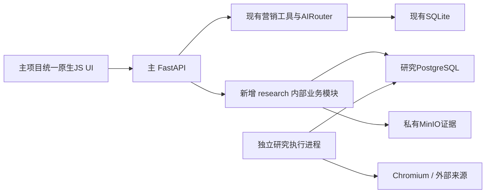
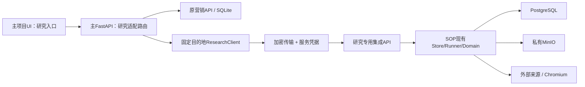
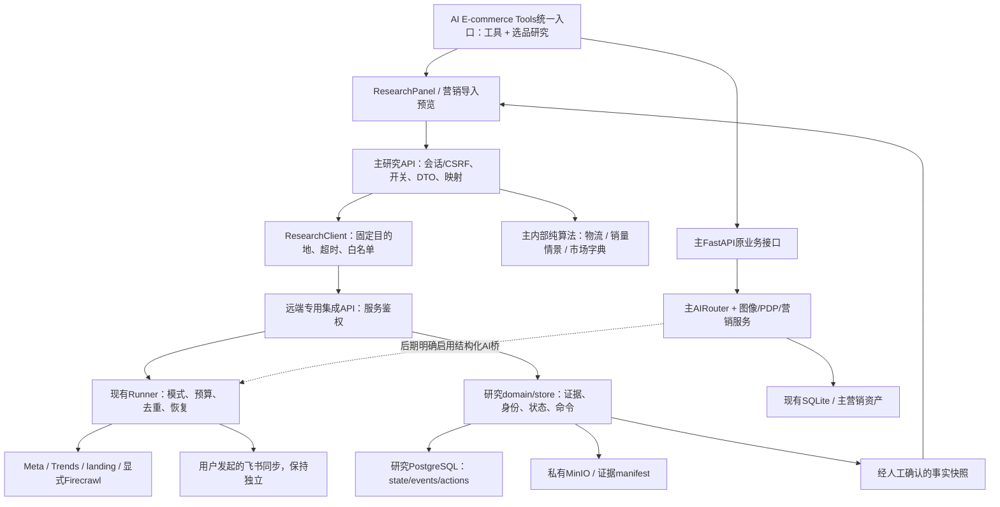

# 04 融合架构方案

日期：2026-10-08。方案中的目录、API与类型全部为**建议新增**，不是现有代码事实。事实依据、功能分类和风险分别见01、02、03。以主项目为核心，保留其运行、UI、历史与存储。

## 1. 三套方案对比

| 项目 | A 直接模块化整合 | B 独立服务接口集成 | C 渐进式融合（推荐） |
|---|---|---|---|
| 主项目入口 | 原UI+research内部视图 | 原UI+research适配视图 | 先原UI适配，逐步形成统一研究-营销流程 |
| 研究API | 进入主FastAPI进程 | 保留远端研究服务 | 先独立，成熟纯能力进入主模块；研究核心仍服务化 |
| 数据库 | 主SQLite不变；研究仍PG | 两库独立 | 两库独立、跨域引用；以后同库需另立项 |
| 浏览器/worker | 独立进程但与主统一管理 | 远端保留原部署 | 先原部署，后可统一版本/仓库/部署清单 |
| 依赖与测试 | 多数运行依赖合并，冲突压力高 | 环境隔离，契约测试新增 | 主先只增加httpx适配；算法逐项归并 |
| UI复用 | 要重建研究面板 | 可以先只读面板/打开原工作台 | 只读→事实交接→写操作渐进统一 |
| 发布回滚 | 共享进程，故障域更大 | 单独开关/服务版本 | 阶段开关、数据单写者、可逐阶段退回B |
| 复杂度/风险 | 高/高 | 中/中；业务深融合较弱 | 中高/中；按阶段隔离高风险 |
| 维护成本 | 进程少但耦合高、仍有PG/MinIO | 两系统+稳定适配层 | 初期两系统；长期单入口/共用低风险能力，研究基础设施保留 |
| 适用性 | 以后资源/测试成熟时评估 | 快速验证与长期安全边界 | 最符合主项目优先与未来扩展 |

工作量为推断：A全量内部化约40–65人日；B最小只读入口约7–12人日、带事实交接约13–19人日；C完整建议路线28–45人日。估算基准见03；不得将此作为报价或完成日期承诺。

## 2. 方案A：直接模块化整合

### 2.1 整体架构



直接整合指代码模块和HTTP入口内部化，**不把PG降为SQLite，也不把浏览器任务塞入Web请求**。若坚持数据库和进程也全合并，A不适合实际项目。

### 2.2 预计目录

```text
M/
├── run.py                         # 现有9502/9503，按明确开关扩展
├── backend/
│   ├── main.py / db.py            # 现有核心保留
│   ├── routes/research.py         # 新研究API；不是原app直接mount
│   ├── modules/research/
│   │   ├── domain/                # 身份、规则、证据、评分、测试
│   │   ├── persistence/           # 独立PG Engine/元数据
│   │   ├── collectors/           # 安全采集驱动
│   │   ├── runner.py
│   │   └── migrations/           # 与主init_db严格分离
│   └── tests/research/
├── frontend/js/research.js
├── frontend/css/research.css
└── deploy/research/               # PG/MinIO/浏览器执行配置
```

### 2.3 模块、数据库、前后端与API

- 主营销工具仍归main/routes/generation/storage；研究领域状态、评分、test/review归新research模块。
- SQLite继续存主历史和设置；PG存研究state/events/actions、队列及sync；两种Session不可混用，一个HTTP业务不能伪装成跨库原子事务。
- frontend/index.html加研究区域，沿用主侧栏；重建SOP视图，不复用原全局S脚本。主旧端点保持。
- 新/api/research/v1由主app提供，内部调用domain/store；长任务入PG，异步结果查询。
- 新PG连接由研究模块显式构建，不能被主db.init_db管理；研究migration显式部署，不能随main导入运行。

### 2.4 新增、修改、删除与难点

新增research域包/PG适配器/队列入口/前端面板/独立迁移。修改main仅注册路由，run增加可选研究管理，AI服务补结构化适配。**删除：首期零删除**；原远端服务在至少一轮恢复验证后才能提出停用计划。

难点：包导入路径、fcntl平台约束、SDK协议、同步/异步数据库共存、queue所有者、两套provider配置、原API安全防护重建。尽管Web框架相同，集成面大。

优点：一个API进程，业务内部调用方便，长期模块统一。缺点：研究PG/MinIO仍不可省，主API也承担新生命周期/依赖，故障容易蔓延。复杂度高、初始回归风险高、后续维护需熟悉全部模块。**不推荐首选。**

## 3. 方案B：保留独立模块，通过接口集成

### 3.1 整体架构



SOP原工作台继续独立打开作为高级操作/恢复入口。现有CSP不改，禁止iframe；统一主UI展示研究摘要、队列和下一步，非简单套iframe。

### 3.2 预计目录

```text
M/
├── backend/routes/research.py
├── backend/models/research.py
├── backend/services/research_client.py
├── backend/services/research_mapper.py
├── frontend/js/research.js
├── frontend/css/research.css
├── backend/tests/test_research_contract.py
└── frontend/tests/research_view.test.js
R/
├── src/rabbit_hole/integration_api.py   # 新专用接口、独立服务凭据
├── src/rabbit_hole/integration_contracts.py
├── src/rabbit_hole/api.py               # 注册接口，原工作台继续使用原guard
└── tests/test_integration_api.py
```

### 3.3 归属、数据与接口

- SOP所有研究能力/持久数据/外部采集继续远端所有；主只渲染和形成营销输入，不直接写PG。
- 主新增研究链接/导入快照到独立扩展记录；同款身份、原件、研究decision仅从SOP引用。
- 初期只读项目/产品/证据摘要/报告；写操作后续经过独立授权与命令幂等。API网关不代理SOP provider-settings、AI配置或主secret reveal。
- R新/internal/integration/v1接口提供业务数据，服务器固定secret鉴权及范围校验。原workbench token不放浏览器跨站使用。
- 研究失联只降级research视图，主/api/ai/generate、历史、图像/Listing/Ads继续运行。

### 3.4 新增、修改、删除与难点

新增client、DTO、mapper、研究面板、远端专用接口及契约测试。修改主main/index和远端api注册。无删除、无依赖主栈替换、无需数据合库。

难点：网络传输、身份/版本契约、跨服务超时、断线命令状态、原研究数据体量、独立部署版本管理。安全措施不能通过“去掉同源校验”简化。

优点：最可回滚，隔离PG/浏览器/外部写入，适合远端实际部署。缺点：若止于链接/嵌套导航，交互与provider配置仍重复；共用能力少，维护两套契约。复杂度中、风险中、长期维护中。**可作稳定终态与C的初期基础。**

## 4. 方案C：渐进式融合与重构（推荐）

### 4.1 整体架构与演进



前期B服务边界，逐步把A类纯能力放进主项目；重复的provider/翻译/采集能力通过专用适配统一接口，研究证据和任务保持独立。长期可统一源码管理/版本发布，但“不强制单库”是有意的技术决策，不是融合未完成。

### 4.2 建议目录

```text
M/
├── run.py                              # 原9502/9503默认行为保留
├── backend/
│   ├── main.py / db.py                  # 不全面拆分/替换
│   ├── routes/research.py               # 版本化浏览器接口
│   ├── models/research.py               # DTO与确认事实类型
│   ├── services/research_client.py      # 唯一研究服务通信入口
│   ├── services/research_mapper.py      # 研究→营销，丢弃不可信确认
│   ├── services/research_import_service.py
│   ├── services/research_link_repository.py
│   ├── modules/research_math/
│   │   ├── logistics.py
│   │   ├── estimates.py
│   │   └── markets.py
│   ├── services/structured_ai_service.py # 后期schema-aware桥接
│   └── tests/test_research_*.py
├── frontend/
│   ├── index.html                       # 主侧栏新增research
│   ├── js/research.js                   # 单一命名空间
│   ├── css/research.css                 # 全限定选择器
│   └── tests/research_*.test.js
├── docs/merge-assessment/               # 本次五份评估
├── docs/research-contracts/             # 后续API schema/兼容政策
└── deploy/research/                     # 后续版本清单/加密连接与恢复流程

R/                                      # 现阶段继续现有远端checkout
└── src/rabbit_hole/
    ├── integration_api.py
    ├── integration_contracts.py
    ├── marketing_ai_adapter.py          # 后期且可单独关闭
    ├── workbench_store.py / domain.py   # 单写者不变
    └── ...现有采集、worker、证据...

可选终态：M/services/research/           # 未来源码统一管理，单独容器/锁/迁移
```

不在当前阶段创建以上业务文件。未来源码归并需先清点镜像、锁文件、授权及状态；本地旧jeffrey版本不能用于代替远端R。

### 4.3 单写入所有权和数据库处理

| 对象 | 权威存储/写入方 | 另一侧权限 |
|---|---|---|
| 原营销历史、provider bindings、品牌档案 | 主SQLite / 主现有服务 | SOP无直接数据库访问 |
| 研究项目/关键词/商品/身份/决策/测试 | SOP PG / domain+store commands | 主通过授权命令接口，不能裸更新PG |
| 原始证据/截图/原文/manifest | SOP私有MinIO+PG引用 | 主仅按需受控读取 |
| 营销图、PDP、HTML/ZIP、公有托管 | 主项目资源与现有目的地 | SOP引用artifact，不当原始证据 |
| 研究↔营销链接/导入事件 | 主新增SQLite扩展表（后期） | 存引用/接受字段、来源版本，不复制完整项目state |
| 中文广告阅读翻译缓存 | 研究私有SQLite cache | 译文仅衍生展示，原文/核对引文不变 |

新增主研究扩展表建议：
- research_links：id、source_system、source_project_id、source_product_id、identity_revision、source_version、target_kind/target_id、created_at_utc。
- research_import_events：import_id唯一、digest、source_ref、accepted_fields JSON、target_ref、created_at_utc。
- 不给source_project_id设跨库FK；一致性通过查源、版本门禁、链接状态重验。
- 旧历史payload可增可选research_ref，缺失字段按旧行为；不批量回写旧记录。
- 不复制全项目state到AppSetting；不把研究事件混进可批量删除的通用历史。
- 不使用分布式事务；本地导入在单SQLite事务完成，远端关联以幂等引用命令处理并显示pending/unknown。
- 未来如需改DB，必须新增可逆数据迁移计划，包含事件/UUID/时区/JSONB/locks与对象恢复；不属于本推荐必要工作。

### 4.4 版本化API与数据契约（拟新增）

主浏览器接口：/api/research/v1。研究专用服务器接口：/internal/integration/v1。两个前缀严格分开。

首期只读：

| 端点 | 用途/保护 |
|---|---|
| GET /session（仅主浏览器侧） | 本机会话+CSRF令牌；research路径专属，不改变旧工具请求 |
| GET /status | 仅报告集成版本/可用性，不触发外部source探测 |
| GET /projects?cursor=&limit= | 小列表、最大50，勿返回全部JSONB state |
| GET /projects/{id} | 项目摘要、version、market、缺口 |
| GET /projects/{id}/products/{product_id} | 经裁剪产品事实/身份/最新证据摘要 |
| GET /projects/{id}/report | 带类型和版本的研究报告 |
| GET /projects/{id}/assets/{evidence_id} | 验证对象归属后流式返回、限制类型/大小，不任意URL透传 |

后期写操作：

- POST /projects/{id}/commands：command_id(UUID)、expected_version(int)、action(白名单)、payload；同ID同digest返回同结果，同ID不同digest=409。
- POST /projects/{id}/actions：明确种类、source_version、country、execution_mode、client_operation_id；服务端维护去重和预算。
- GET /projects/{id}/actions/{id}：支持提交后查状态；stop/retry分独立动作，不用通用HTTP重试。
- POST /marketing-imports/preview 与 /marketing-imports（主侧）：按source_ref和用户接受字段生成预览/导入，import_id幂等。
- 飞书sync与供应商设置不在通用集成白名单中；需要单独方案和明确用户触发。

建议DTO（逻辑形状，不是照抄源JSON字段）：

```json
{
  "schema_version": "1.0",
  "source_ref": {
    "system": "rabbit_hole",
    "project_id": "<UUID>",
    "product_id": "<string>",
    "identity_revision": 1,
    "source_version": 7
  },
  "market": "US",
  "facts": [
    {
      "key": "material",
      "value": "<只在有证据时填>",
      "state": "confirmed",
      "confirmation_method": "human",
      "confirmed_at": "<UTC ISO8601>",
      "evidence_refs": ["<受控引用>"]
    }
  ],
  "scores": [
    {"type": "research_qualification", "version": "<rules>", "state": "unknown"}
  ]
}
```

confirmed必须服务端核实当前identity和人工确认，不能信任浏览器标记或仅SOP AI matched。字段缺证据时state=unknown/value=null；源平台原广告报价不能默认变成自家承诺。错误envelope包含code/message/retryable/operation_id；不能返回secret、原始provider异常、数据库SQL。

### 4.5 前后端和服务整合

- research.js独立管理加载/空/失败/离线/冲突/未知结果状态；新增面板不得清空当前生成成功结果或localStorage草稿。
- 草稿交接先预览确认，再调用主现有品牌/Listing/Ads/Details公开函数；具体DOM/函数映射先用隔离fixture补契约，不修改整体页面架构。
- 研究数据通过主后端client获取。固定远端地址，禁止用户提供proxy URL；GET允许少量有限重试，commands与付费请求不通用自动重试。
- 主research会话只覆盖新路径：canonical 127.0.0.1本机入口、HttpOnly/SameSite cookie、明确前端Origin/CSRF；研究客户端使用credentials且不改旧工具fetch。HTTPS下cookie Secure；loopback开发模式需明确记录。
- 专用远端接口service credential限制project/read/command作用域、constant-time比对、拒绝跨project资产；不能放行旧guard或让前端持有service secret。建议本机加密SSH端口隧道到研究loopback，或受保护HTTPS；本阶段不建立连接隧道。
- 可选AI桥是SOP调用主的专用内部结构化接口，**不暴露/api/settings与secret reveal**；结构化校验、引用校验和预算保留研究域。桥关闭时返回明确未启用，不自动改用另一提供商。
- 统一request_id/operation_id日志脱敏；主实时日志与SOP持久日志不混存。

### 4.6 新增/修改/删除、优缺点与推荐理由

新增：研究面板/client/DTO/mapper、远端只读专用接口、纯算法包、后期链接表/幂等导入、结构化AI适配/契约测试、部署和恢复说明。

修改：main仅增新路由/feature flags；index新增导航/面板；brand_context与业务输入接收明确确认后的快照；R api注册integration_router，后期以适配替换指定AI调用点。主DB后期只加独立扩展表，不改旧表含义。

删除：8阶段默认零业务删除；重复旧驱动要在双轨验证、使用者清点、恢复保留期后另提退役建议并审核。原CLI/工作台/worker不自动删除。

关键难点：可信事实映射、专用认证、断线后的命令一致性、双库引用、模型schema适配、队列恢复与长期源码管理。

优点：保留主架构/功能，早期可验证业务收益，分域防回归，研究来源可追溯，新增工具/工作流有清晰接口。缺点：不消除PG/MinIO，初期部署两系统，需维护契约与版本；完整工作台的UI重建有工作量。

推荐C优于A：没有把主入口变成新队列/浏览器依赖的统一故障域，不要求降级研究数据库。优于只做B：有明确的纯能力复用、提供商适配、事实交接和统一业务流程路线，可逐步减少重复；同时每阶段都能退回B。

## 5. 方案选择和审核范围

建议审核：采用C、主功能全部保留、首期0–3阶段、两库/原证据保留、不开放公网、不启用自动采集/同步/投放。审核通过后才允许05中的备份、测试环境、代码与部署任务。

MVP不包括：全部研究写操作、飞书外部同步、同库迁移、完整源码搬家、新平台API开发、账户/RBAC公网产品化。若仅MVP即满足日常使用，可以停在已验收服务边界，后续按收益再决定。
